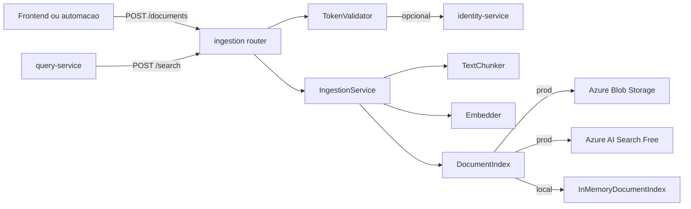
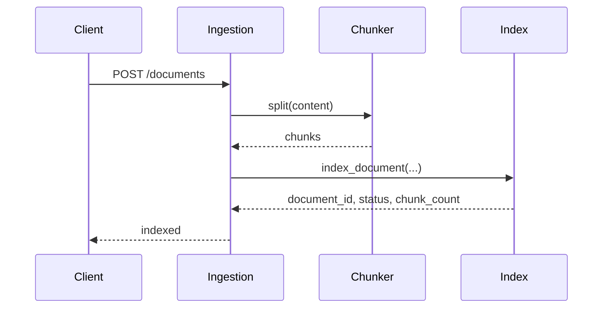
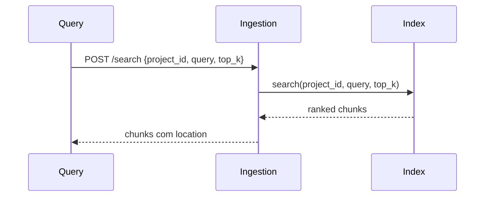
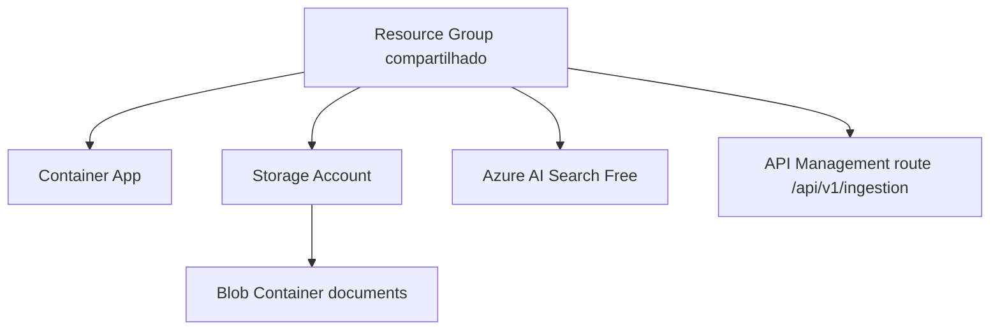

# docai-ingestion-service

Servico FastAPI responsavel por ingestao, chunking, embeddings e busca
documental. Este servico e o unico dono do indice vetorial e do armazenamento
de arquivos/chunks. O query-service nunca acessa AI Search diretamente.

## Arquitetura



## Fluxo De Ingestao



## Fluxo De Busca



## Estrutura

```text
app/
  config.py
  dependencies.py
  main.py
  domain/models.py              # IndexedDocument e IndexedChunk
  routers/ingestion.py          # HTTP
  schemas/ingestion.py          # contratos
  repositories/document_index.py # boundary do indice
  services/chunker.py           # chunking
  services/embedder.py          # boundary de embeddings
  services/retriever.py         # boundary de recuperacao
  services/ingestion_service.py # regras de ingestao
  services/token_validator.py   # dev/internal token
```

## Contratos

### Criar Documento

```json
{
  "project_id": "proj-demo",
  "material_id": "mat-architecture",
  "file_name": "architecture.md",
  "content": "texto do documento"
}
```

### Buscar

```json
{
  "project_id": "proj-demo",
  "query": "pergunta",
  "top_k": 5
}
```

Resposta:

```json
{
  "chunks": [
    {
      "document_id": "doc-1",
      "project_id": "proj-demo",
      "material_id": "mat-architecture",
      "file_name": "architecture.md",
      "location": "architecture.md#chunk-0",
      "chunk_index": 0,
      "chunk_text": "...",
      "score": 0.95
    }
  ]
}
```

## Azure Ownership



## Execucao Local

```bash
pip install -r requirements.txt -r requirements-dev.txt
uvicorn app.main:app --reload --port 8003
```

## Qualidade

```bash
ruff check app tests
mypy app
python -m pytest
```

## Variaveis De Ambiente

| Variavel | Descricao |
| --- | --- |
| `BEARER_TOKEN` | Token dev para chamadas externas |
| `INTERNAL_SERVICE_TOKEN` | Token usado por query-service |
| `IDENTITY_SERVICE_URL` | Validador real opcional |
| `DEFAULT_CHUNK_MAX_WORDS` | Tamanho padrao dos chunks |

## Terraform

Este repo cria Blob Storage, AI Search Free, Container App e rota APIM.

```bash
scripts/terraform-bootstrap.sh
RUN_TERRAFORM_PLAN=true scripts/terraform-bootstrap.sh
```
